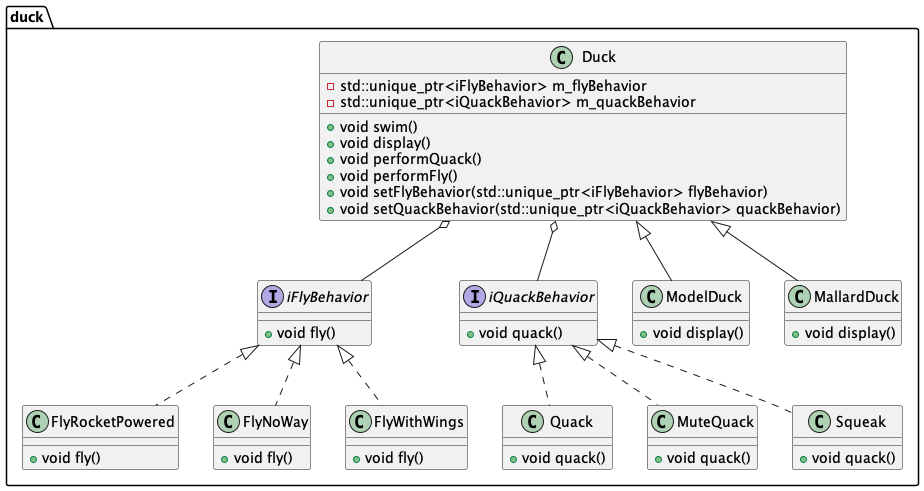

# Chapter 01: Strategy Design Pattern

## Overview

The Strategy Pattern is one of the **behavioral** design patterns. It defines a family of algorithms, encapsulates each one, and makes them interchangeable. This allows the algorithm to vary independently from the clients that use it. Essentially, it enables you to select algorithms at runtime.

## Key Components

1. **Strategy Interface**: This defines a common interface for all supported algorithms. For example, `iFlyBehavior` and `iQuackBehavior` in our code.
2. **Concrete Strategies**: These are classes that implement the Strategy interface. For example, `FlyWithWings`, `FlyNoWay`, `Quack`, `MuteQuack`, etc.
3. **Context**: This is a class that uses a Strategy. For example, the `Duck` class.

## Example

In our example, we have a `Duck` class that can perform different behaviors such as flying and quacking. These behaviors are defined by the `iFlyBehavior` and `iQuackBehavior` interfaces. Different implementations of these interfaces provide different behaviors.



### Duck Class

```cpp
#pragma once

#include "ifly_behavior.hpp"
#include "iquack_behavior.hpp"

#include <iostream>
#include <memory>

namespace duck {

class Duck {
public:
  virtual ~Duck() = default;
  Duck(const Duck &) = delete;
  Duck(Duck &&other) noexcept 
    : m_flyBehavior(std::move(other.m_flyBehavior))
    , m_quackBehavior(std::move(other.m_quackBehavior)) {}
  Duck &operator=(const Duck &) = delete;
  Duck &operator=(Duck &&other) noexcept {
    if (this != &other) {
        m_flyBehavior = std::move(other.m_flyBehavior);
        m_quackBehavior = std::move(other.m_quackBehavior);
    }
    return *this;
  }

  void swim() const { std::cout << "I'm swimming.\n"; }
  virtual void display() = 0 ;

  void performQuack() { m_quackBehavior->quack(); }
  void performFly() { m_flyBehavior->fly(); }

  void setFlyBehavior(std::unique_ptr<iFlyBehavior> flyBehavior) {
    m_flyBehavior = std::move(flyBehavior);
  }
  void setQuackBehavior(std::unique_ptr<iQuackBehavior> quackBehavior) {
    m_quackBehavior = std::move(quackBehavior);
  }

protected:
  Duck() = default;

  std::unique_ptr<iFlyBehavior> m_flyBehavior;
  std::unique_ptr<iQuackBehavior> m_quackBehavior;
};

}
```

### Fly Behavior Interface

```cpp
#pragma once

class iFlyBehavior {
public:
  virtual ~iFlyBehavior() = default;
  virtual void fly() = 0;
};
```

### Quack Behavior Interface

```cpp
#pragma once

class iQuackBehavior {
public:
  virtual ~iQuackBehavior() = default;
  virtual void quack() = 0;
};
```

### Concrete Fly Behaviors

```cpp
#include "ifly_behavior.hpp"
#include <iostream>

class FlyWithWings : public iFlyBehavior {
public:
  void fly() override {
    std::cout << "I'm flying with wings!\n";
  }
};

class FlyNoWay : public iFlyBehavior {
public:
  void fly() override {
    std::cout << "I can't fly.\n";
  }
};
```

### Concrete Quack Behaviors

```cpp
#include "iquack_behavior.hpp"
#include <iostream>

class Quack : public iQuackBehavior {
public:
  void quack() override {
    std::cout << "Quack!\n";
  }
};

class MuteQuack : public iQuackBehavior {
public:
  void quack() override {
    std::cout << "...\n";
  }
};
```

## Conclusion

The Strategy Pattern is a powerful way to manage algorithms and behaviors in a flexible and reusable manner. By encapsulating behaviors in separate classes and using composition, we can easily extend and modify the behavior of our objects without changing their code.

This chapter demonstrates how to implement the Strategy Pattern using a simple example of ducks with different flying and quacking behaviors.
