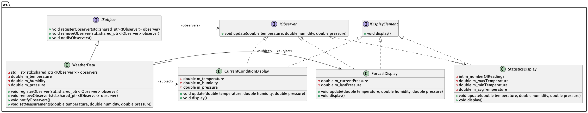

# Chapter 02: Observer Design Pattern

## Overview

In this chapter, we explore the Observer Design Pattern. This pattern is used to define a one-to-many dependency between objects so that when one object changes state, all its dependents are notified and updated automatically.

## Observer Pattern

The Observer Pattern is a behavioral design pattern that allows an object, known as the subject, to maintain a list of its dependents, called observers, and notify them of any state changes, usually by calling one of their methods.

### Key Components

1. **Subject Interface**: This defines methods for attaching and detaching observer objects. For example, `ISubject` in our code.
2. **Observer Interface**: This defines an updating interface for objects that should be notified of changes in a subject. For example, `IObserver` in our code.
3. **Concrete Subject**: This stores the state of interest to ConcreteObservers and sends a notification to its observers when its state changes. For example, `WeatherData` in our code.
4. **Concrete Observer**: These implement the Observer interface to keep their state consistent with the subject's. For example, `CurrentConditionDisplay`, `StatisticsDisplay`, and `ForcastDisplay` in our code.

### When to Use

- When a change to one object requires changing others, and you don't know how many objects need to be changed.
- When an object should be able to notify other objects without making assumptions about who those objects are.

### Pros and Cons

#### Pros

- **Loose Coupling**: The subject and observers are loosely coupled. The subject doesn't need to know the concrete class of an observer, only that each observer implements the `IObserver` interface.
- **Dynamic Relationships**: Observers can be added or removed at any time, allowing for dynamic relationships between objects.
- **Broadcast Communication**: One subject can notify multiple observers, making it easy to broadcast updates.

#### Cons

- **Memory Leaks**: If observers are not properly removed, it can lead to memory leaks.
- **Unexpected Updates**: Observers can be updated unexpectedly, which can lead to issues if not handled properly.
- **Complexity**: The pattern can add complexity to the code, especially when dealing with many observers.

## Weather Station Example

In this example, we implement a simple weather station that uses the Observer Pattern to notify various display elements of changes in weather data. The `WeatherData` class acts as the subject, while `CurrentConditionDisplay`, `StatisticsDisplay`, and `ForcastDisplay` act as observers.

### Class Diagram

Below is the class diagram for the Weather Station example:

This diagram illustrates the relationships between the subject (WeatherData), the observers (CurrentConditionDisplay, StatisticsDisplay, ForcastDisplay), and the interfaces they implement (IObserver, ISubject, IDisplayElement).

## Conclusion

The Observer Pattern is a powerful way to manage dependencies between objects in a flexible and reusable manner. By defining clear interfaces for subjects and observers, we can easily extend and modify the behavior of our objects without changing their code.

This chapter demonstrates how to implement the Observer Pattern using a simple example of weather data and various display elements.
