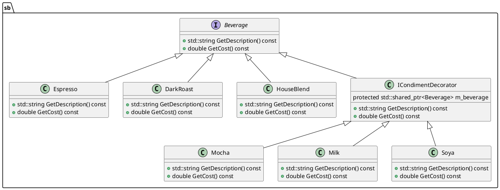

# Chapter 03: Decorator Design Pattern

## Overview

In this chapter, we explore the Decorator Design Pattern. This pattern is used to dynamically add behavior and responsibilities to objects without modifying their code. The Decorator Pattern provides a flexible alternative to subclassing for extending functionality.

## Decorator Pattern

The Decorator Pattern is a **structural** design pattern that allows behavior to be added to individual objects, either statically or dynamically, without affecting the behavior of other objects from the same class.

### Key Components

1. **Component Interface**: This defines the interface for objects that can have responsibilities added to them dynamically. For example, `Beverage` in our code.
2. **Concrete Component**: This is the class to which additional responsibilities can be attached. For example, `Espresso`, `DarkRoast`, and `HouseBlend` in our code.
3. **Decorator Base Class**: This maintains a reference to a `Component` object and defines an interface that conforms to the `Component` interface. For example, `ICondimentDecorator` in our code.
4. **Concrete Decorators**: These are classes that extend the functionality of the `Component` by adding responsibilities. For example, `Mocha`, `Milk`, and `Soya` in our code.

### When to Use

- When you need to add responsibilities to individual objects dynamically and transparently, without affecting other objects.
- When extending functionality by subclassing is impractical due to the large number of independent extensions or the need to mix and match them.

### Pros and Cons

#### Pros

- **Flexibility**: Responsibilities can be added and removed dynamically.
- **Reusability**: Decorators can be reused across different objects.
- **Single Responsibility Principle**: Functionality can be divided between classes with unique areas of concern.

#### Cons

- **Complexity**: The use of many small decorator classes can make the code more complex and harder to understand.
- **Performance**: The use of multiple decorators can lead to performance overhead due to the increased number of objects.

## Coffee Shop Example

In this example, we implement a simple coffee shop application that uses the Decorator Pattern to dynamically add condiments to different types of beverages. The `Beverage` class acts as the component, while `Espresso`, `DarkRoast`, and `HouseBlend` act as concrete components. The `ICondimentDecorator` class acts as the decorator base class, and `Mocha`, `Milk`, and `Soya` act as concrete decorators.

### Class Diagram

Below is the class diagram for the Coffee Shop example:


Here is a 

README.md

 file for 

chapter-03-decorator

 that explains the Decorator design pattern, when to use it, its pros and cons, and includes a section about the example used in this chapter:

```markdown
# Chapter 03: Decorator Design Pattern

## Overview

In this chapter, we explore the Decorator Design Pattern. This pattern is used to dynamically add behavior and responsibilities to objects without modifying their code. The Decorator Pattern provides a flexible alternative to subclassing for extending functionality.

## Decorator Pattern

The Decorator Pattern is a structural design pattern that allows behavior to be added to individual objects, either statically or dynamically, without affecting the behavior of other objects from the same class.

### Key Components

1. **Component Interface**: This defines the interface for objects that can have responsibilities added to them dynamically. For example, `Beverage` in our code.
2. **Concrete Component**: This is the class to which additional responsibilities can be attached. For example, `Espresso`, `DarkRoast`, and `HouseBlend` in our code.
3. **Decorator Base Class**: This maintains a reference to a `Component` object and defines an interface that conforms to the `Component` interface. For example, `ICondimentDecorator` in our code.
4. **Concrete Decorators**: These are classes that extend the functionality of the `Component` by adding responsibilities. For example, `Mocha`, `Milk`, and `Soya` in our code.

### When to Use

- When you need to add responsibilities to individual objects dynamically and transparently, without affecting other objects.
- When extending functionality by subclassing is impractical due to the large number of independent extensions or the need to mix and match them.

### Pros and Cons

#### Pros

- **Flexibility**: Responsibilities can be added and removed dynamically.
- **Reusability**: Decorators can be reused across different objects.
- **Single Responsibility Principle**: Functionality can be divided between classes with unique areas of concern.

#### Cons

- **Complexity**: The use of many small decorator classes can make the code more complex and harder to understand.
- **Performance**: The use of multiple decorators can lead to performance overhead due to the increased number of objects.

## Coffee Shop Example

In this example, we implement a simple coffee shop application that uses the Decorator Pattern to dynamically add condiments to different types of beverages. The `Beverage` class acts as the component, while `Espresso`, `DarkRoast`, and `HouseBlend` act as concrete components. The `ICondimentDecorator` class acts as the decorator base class, and `Mocha`, `Milk`, and `Soya` act as concrete decorators.

### Class Diagram

Below is the class diagram for the Coffee Shop example:



This diagram illustrates the relationships between the component (`Beverage`), the concrete components (`Espresso`, `DarkRoast`, `HouseBlend`), the decorator base class (`ICondimentDecorator`), and the concrete decorators (`Mocha`, `Milk`, `Soya`).

## Conclusion

The Decorator Pattern is a powerful way to extend the functionality of objects in a flexible and reusable manner. By defining clear interfaces for components and decorators, we can easily add new behavior to objects without modifying their code.

This chapter demonstrates how to implement the Decorator Pattern using a simple example of a coffee shop with various beverages and condiments.
